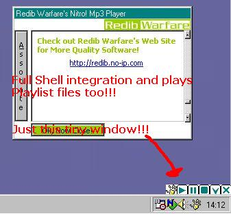



## Nitro\! Mp3 Player

### Description

The littlest possible window, prepared to focus all your attention on the music.
 
### More Info
 
You should compile it before running it. And after that, associate it, moving your mouse over the icon that apears on the systray and clicking on the app icon.

A window will open and you will find a button with "associate" as a caption.

To open an mp3, double click on the file after associating this program, or drag the mp3 into the compiled app.

The rest is very simple.

             |
---                |---
**Submitted On**   |2002-07-31 14:28:08
**By**             |[\. Facu \.](https://github.com/Planet-Source-Code/PSCIndex/blob/master/ByAuthor/facu.md)
**Level**          |Intermediate
**User Rating**    |5.0 (10 globes from 2 users)
**Compatibility**  |VB 5\.0, VB 6\.0
**Category**       |[Sound/MP3](https://github.com/Planet-Source-Code/PSCIndex/blob/master/ByCategory/sound-mp3__1-45.md)
**World**          |[Visual Basic](https://github.com/Planet-Source-Code/PSCIndex/blob/master/ByWorld/visual-basic.md)
**Archive File**   |[Nitro\!\_Mp31129027312002\.zip](https://github.com/Planet-Source-Code/facu-nitro-mp3-player__1-37453/archive/master.zip)

